# Архитектура приложения

Описание обозначения в схемах:
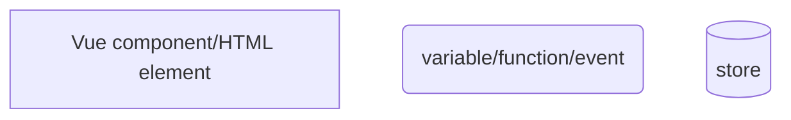
Так же обозначение передаваемых данных или вызываемых функций могут находиться на стрелках между блоками.

## Авторизация

За авторизацию отвечает SignUp компонент, состоящий из следующих блоков:
1. Блок form.scrollbars состоящий из Inputs и RadioButtonGroup

Значение каждой формы привязано к стору `$signInFields`. Заполнение Inputs вызывает event `fillForm` обновляющий значение стора `$signInFields` в `@/store/signIn` с параметрами (field: название поле, value: значение)
Также каждая форма взаимодействует со стором ошибок `$signInErrors`, у каждого Input есть атрибут @blur вызывающий `setFieldError` с названием поля и правилом для его заполнения rule. 
Если правило не будет выполнено, сработает event `setError` добавляющий к field текст с ошибкой из списка errorList в i18n.
Блок RadioButtonGroup отвечает за выбор типа очереди `queueType` при инициализации SDK клиента.

Когда компонент будет смонтирован произойдёт вызов restoreFillForm(). Включающий в себя:
- заполнение форм из `$signInFields` store или getLoginData() читающий данные для входа из параметра sdk_login_data в local storage
- checkErrors() проверяющий заполненные данные из localstorage или store

2.  Блок .button-wrap

Состоит из Checkbox с привязкой значения к fields.remember в `$signInFields`. При значении true вызывается saveLoginData() сохранений авторизационные данные параметром sdk_login_data в local storage.
И Button с функцией loginFx на клике, выполняющий отправку авторизационных данных в SDK sdkLogin(fields). Подробнее описано в [Авторизация в SDK](https://git.zingaya.com/demo/webphone/-/blob/CP-2839_softphone/README2.md#%D0%B0%D0%B2%D1%82%D0%BE%D1%80%D0%B8%D0%B7%D0%B0%D1%86%D0%B8%D1%8F-%D0%B2-sdk)
Кнопка входа будет заблокирована(isActiveSignIn), при наличии ошибок в $signInErrors
Схема элементов верстки в `SignUp.vue`
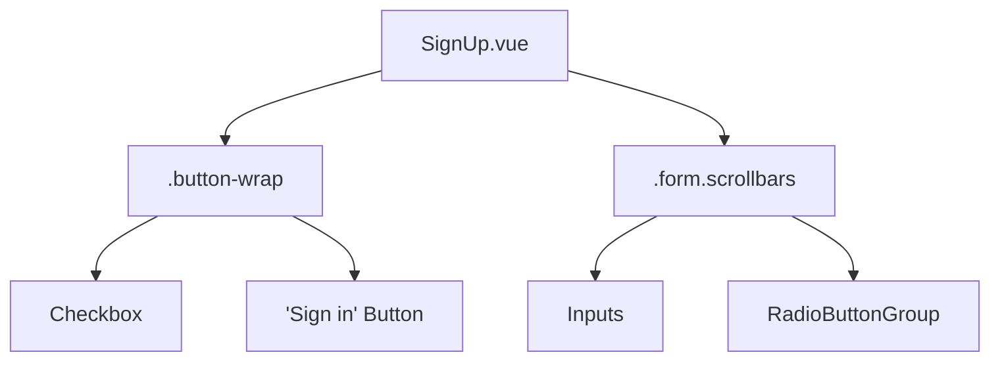
взаимодействие элементов с эвентами и сторами:
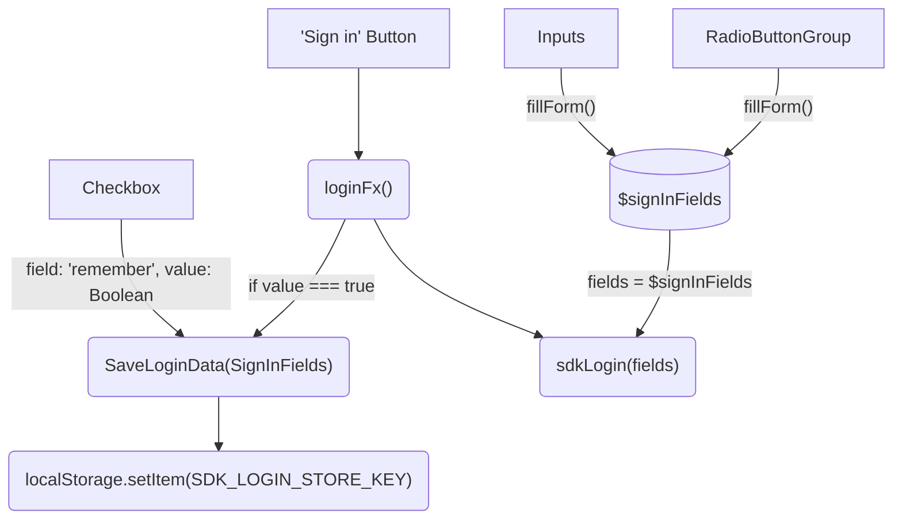

### Авторизация в SDK
Функция `sdkLogin` принимает на вход значение полей, типа `SignInFields`. Из этого объекта парсятся значения полей из формы `SignUp.vue`:
- userName
- accountName
- applicationName
- password
- queueType

Из полей составляется логин `loginData`, формата `${userName}@${applicationName}.${accountName}.${node}.voximplant.com`. 
Если SDK ещё не инициализирован, проверяется доступ к аудио девайсам, при успешном ответе собираем конфиг с указанием контейнеров под видео.
Этот конфиг используем при инициализации SDK клиента `await sdkClient.init(params)` затем подключаемся `sdkClient.connect()`.
Устанавливаем активные девайсы, делаем `sdkClient.login()` используя собранный `loginData` и `password` из поля формы. 
При успехе переходим в компонент `Dialing.vue`, в обратном случае подсвечиваем поле через `setError({field, value})`.

Для того чтобы выйти из аккаунта, необходимо вызвать функцию logout, включающий disconnect у SDK.

## Звонки

### Обработка звонка на стороне VoxEngine
```javascript
VoxEngine.addEventListener(AppEvents.CallAlerting, function (e) {
  const outCall = VoxEngine.callUser(e.destination, e.callerid, e.displayName, null, true, e.scheme);
  VoxEngine.easyProcess(e.call, outCall);
  
  e.call.addEventListener(CallEvents.MessageReceived,(ev)=> {
    const { text } = ev;
    const sendList = ()=> {
      conf.getList().forEach(ep=>{
          ep.sendMessage(JSON.stringify({
            name:'message',
            payload:{
              command: 'changeDisplayName',
              displayNames: Array.from(displayNameMap.entries()).reduce((acc,el)=>{acc[el[0]]=el[1]; return acc},{})
            }
          }));
        })
    }
    try {
      const data = typeof text === 'object'?text:JSON.parse(text);
      if(data && data.command === 'setMyDisplayName') {
        displayNameMap.set(e.call.id(), data.displayName);
        sendList();
      }
      if(data && data.command === 'getDisplayNames'){
        sendList();
      }
    } catch(err) {
      Logger.write(err);
    }
  })
});
```

- CallAlerting подписка VoxEngine на событие о поступлении входящего вызова
- MessageReceived подписка на событие звонка добавляет возможность передавать сообщения между участниками

### Набор номера
Указание адресата вызова происходит в компоненте Dialing

1. .dialing-input
При изменении формы, срабатывает событие changeInputValue и адресат заполняется в $phoneInput стор.
2. Numpad
 При клике на кнопки Numpad вызывается событие changeInputValue, в которое прокидывается значение нажатой кнопки.
3. .buttons-wrap 
кнопки звонков audio и video, кнопка повторного набор, появляющаяся при сторе needToShowAdditionalButton = true

При аудио звонке в функцию actionOnBtn прокидывается параметр 'primary' при звонке с видео 'video' с которым будет вызван createCall()

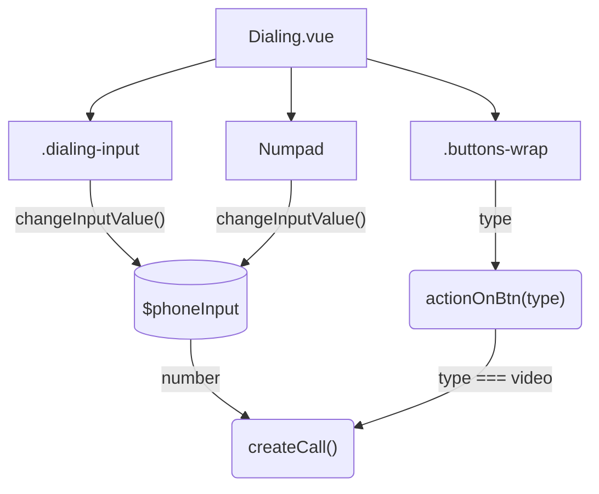

### Аудио звонок
Для использования softphone в режиме только аудио звонков, необходимо **в конфигурации `src/config.ts` установить флаг `AUDIO_ONLY` в `true`**.

За UI в аудио звонках отвечает компонент `src/components/Call.vue` Общая схема элементов `Call.vue`:
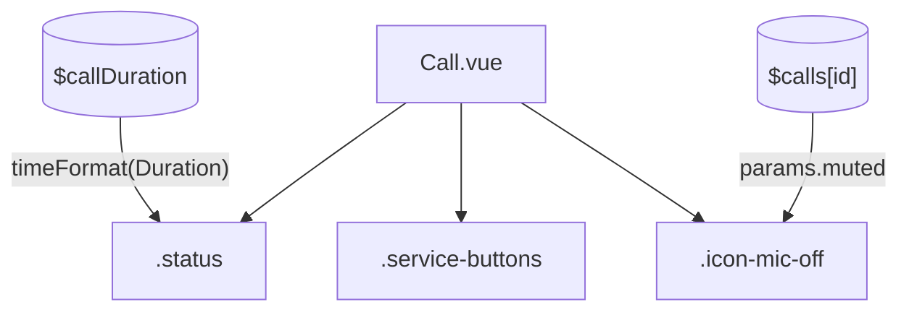
Детальная схема блока с кнопками`.service-buttons`:


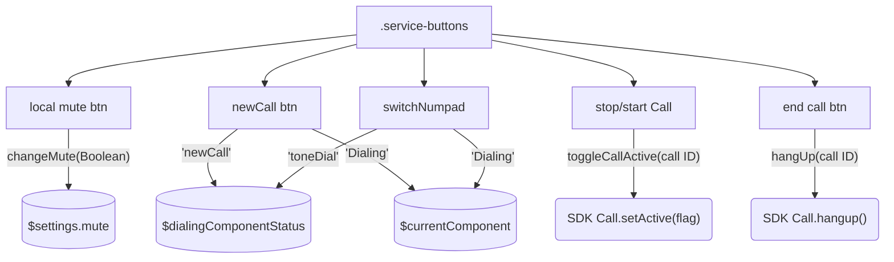

#### Создание звонка
Вызывается функция `createCall(number, video)` с параметрами:
- number: String номер на который будет исходить звонок
- video: Boolean флаг указывающий, что звонок с видео

Создание аудио звонка:
1. Создаются настройки звонка `CallSettings` параметры и их описание можно посмотреть в [документации](https://voximplant.com/docs/references/websdk/voximplant/callsettings)
2. вызов через SDK sdkClient.call(callSettings)
3. номер записывается в $lastCallNumber
4. информация полученная из SDk + id сохраняются в $calls
5. звонок становиться активным setActiveCall
6. триггерится openCallState меняющий страничку на `Call`
7. на созданный звонок, устанавливаются [события](https://voximplant.com/docs/references/websdk/voximplant/callevents).
Подробнее в разделе [список обрабатываемых событий](https://git.zingaya.com/demo/webphone/-/blob/CP-2839_softphone/README2.md#%D1%81%D0%BF%D0%B8%D1%81%D0%BE%D0%BA-%D0%BE%D0%B1%D1%80%D0%B0%D0%B1%D0%B0%D1%82%D1%8B%D0%B2%D0%B0%D0%B5%D0%BC%D1%8B%D1%85-%D1%81%D0%BE%D0%B1%D1%8B%D1%82%D0%B8%D0%B9)

При ошибочных событиях идёт изменение компонента на `CallEnded` и вывод ошибки из `currentSelectCall.status` store.

Softphone подразумевает только один активный звонок.
При создании нового звонка `createCall`:
1. активный будет поставлен на паузу `setCurrentCallAsPaused()`
2. собеседнику будет отправлено событие `setActive(false)`
3. создаётся новый `createSdkCall(number, video)`
4. по событию [Connected](https://voximplant.com/docs/references/websdk/voximplant/callevents#connected) новый звонок устанавливается активным `call.setActive(true)` и сохраняется в `$currentActiveCallId`

#### Входящий аудио звонок

Если у пользователя уже есть активный звонок, по событию [Connected](https://voximplant.com/docs/references/websdk/voximplant/callevents#connected) с новым звонком, старый будет поставлен на паузу. 
Собеседнику будет отправлено событие `setActive(false)` и показано уведомление
<br/> 

При завершении звонка находящегося на паузе вызовется событие `setNotificationState('pauseCallEnded');` и будет показано уведомление
<br/> 

Для приёма звонка необходимо подписать sdkClient на событие `VoxImplant.Events.IncomingCall`:
- устанавливается активный звонок в стор `$calls`
- устанавливается [подписка на события](https://git.zingaya.com/demo/webphone/-/blob/development/README2.md#%D1%81%D0%BF%D0%B8%D1%81%D0%BE%D0%BA-%D0%BE%D0%B1%D1%80%D0%B0%D0%B1%D0%B0%D1%82%D1%8B%D0%B2%D0%B0%D0%B5%D0%BC%D1%8B%D1%85-%D1%81%D0%BE%D0%B1%D1%8B%D1%82%D0%B8%D0%B9) как и при создании нового звонка - `handleCall()`


### Получаемые во время звонка сообщения по `MessageReceived`
Для обмена сообщениями между участниками звонка необходимо добавить обработку события MessageReceived в сценарии VoxEngine. 
Пример кода можно посмотреть в пункте [Обработка звонка на стороне VoxEngine](#Обработка-звонка-на-стороне-VoxEngine)

За обработку кастомных пользовательских событий отвечает функция `handleMessageReceived()`. 
Список обрабатываемых сообщений:
- mute отключение микрофона собеседником, изменяет параметр muted у звонка, в UI появляется иконка icon-mute
- initState сообщение получаемое на старте звонка, содержит параметры старта: включено ли аудио/видео у собеседника
- sharing события включения шаринга от собеседника, устанавливает в звонке параметр remoteSharing, в UI меняется сетка с видео и его размеры
- setActive собеседник поставил звонок на паузу
- userBusy приходит после снятия паузы, означает что собеседник уже занят(имеет активный звонок)

### Видео звонок
Компонент `src/components/VideoCall.vue`
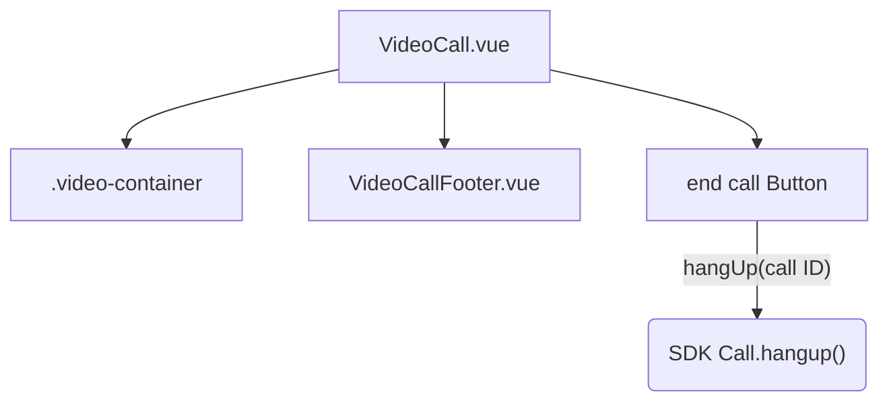
Схема элементов внутри блока `.video-container`
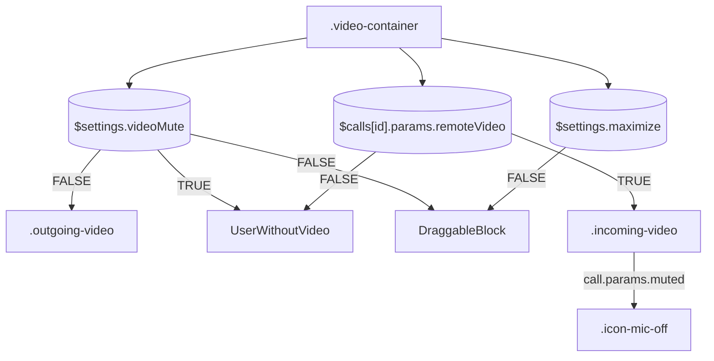

Cхема работы компонента с панелью управления звонком `src/components/calls/VideoCallFooter.vue`

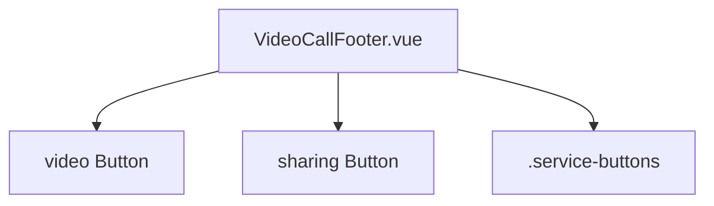
Кнопка включения/выключения шаринга `sharing Button`:
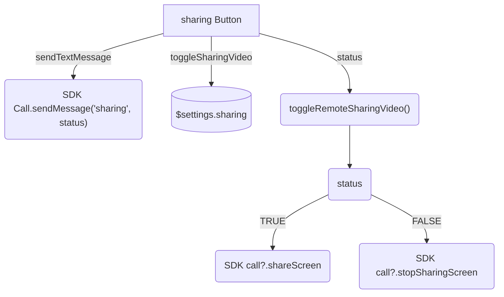
Кнопка включения/выключения видео `video Button`
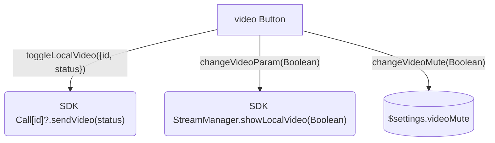

Видео кнопка в блоке `.buttons-wrap` в функцию `actionOnBtn(type)` отправляет type параметр 'video'.
На основе которого в функцию создания звонка `createCall()` прокидывается Boolean параметр video. 
Параметр влияет на [настройку флагов видео](https://voximplant.com/docs/references/websdk/voximplant/videoflags) предаваемых в SDK при создании звонка.
Включается передача видео:
```javascript
const useVideo = {
    sendVideo: video, // передача локального видео
    receiveVideo: !appConfig.AUDIO_ONLY, // включает возможность принимать видео и зависит от аудио/видео режима
};
```
В $calls будет указан параметр `video: true`.

В видео звонках стоит обратить внимание на добавлении событий работы с Media на `EndpointAdded`:
- `RemoteMediaAdded` добавление видео от собеседника
- `RemoteMediaRemoved` собеседник выключил видео, удаление видео элемента

Пришедший `mediaRenderer` от события websdk, рендерится/удаляется в/из div элемент с id: `remote-video`. 
В $calls добавляется параметр `remoteVideo`, в UI меняются стили отображения видео элементов.
Описание вариаций UI видео звонка при изменении параметров в разделе [Лэйаут компонентов](##Лэйаут_компонентов).

#### Перетаскивание локального видео
Для удобства общения с включённым видео в звонках есть возможность перетащить блок с локальным видео.
У него предусмотрены 3 позиции:
- вверху справа (стандартная)
- вверху слева
- снизу слева
<br/> 

Для перетаскивания блока используется библиотека [vue-draggable-next](https://www.npmjs.com/package/vue-draggable-next)

Перетаскиваемый блок находится в компоненте `DraggableBlock.vue`, туда помещается локальное видео `.outgoing-video` через [Teleport](https://vuejs.org/guide/built-ins/teleport.html).
Слоты под перетаскивание имеют класс `.stub`. При срабатывании `startDrag` у компонента `VueDraggableNext` класс блока меняется на `slot-active`.

## Очереди
Список всех текущих звонков activeCalls. В UI можно увидеть в списке `src/components/calls/ActiveCall.vue`
### Статусы операторов
При авторизации `sdkLogin()` в зависимости от выбранного типа очереди `$signInFields.queueType` у SDK запрашивается [статус оператора](https://voximplant.com/docs/references/websdk/voximplant/operatoracdstatuses)
- если QueueType.SmartQueue, то [sdkClient.getOperatorSQMessagingStatus()](https://voximplant.com/docs/references/websdk/voximplant/client#getoperatorsqmessagingstatus)
- если QueueType.ACD, то [sdkClient.getOperatorACDStatus()](https://voximplant.com/docs/references/websdk/voximplant/client#getoperatoracdstatus)
Полученный статус записывается в `$queueStatus`
Также `$queueStatus` меняется через event `setQueueStatus` при срабатывании SDK события [ACDStatusUpdated](https://voximplant.com/docs/references/websdk/voximplant/events#acdstatusupdated)
Статус можно установить вручную, вызвав `setSdkQueueStatus(status)` и прокинув в него ACD или SQ статус.
Изначально тип очереди установлен в `None`, а статус в [Online](https://voximplant.com/docs/references/websdk/voximplant/operatoracdstatuses#online)

Статус 'Banned' в UI отображается отдельной плашкой и переключается событием `toggleBannedStatus` в сторе `$isBannedStatus`
<br/> 

Статусы SmartQueue и ACD отличаются. В SQ есть статус 'Dialing', но нет 'Timeout', а в ACD наоборот.


## Трансферы
В софтфоне **не возможны "Blind" трансферы**. Используются только трансферы с подтверждением, у вас должен быть активный звонок с конечным пользователем.
Изначально **трансфер доступен только для аудио звонков**. Это означает, что в `src/config.ts` флаг `AUDIO_ONLY` должен быть `true`.

Для трансфера звонка используйте функцию `transferCall(String)`, которая вызывает [Client.transferCall(call1, call2)](https://voximplant.com/docs/references/websdk/voximplant/client#transfercall) где:
- call1, звонок из $call, который надо перенаправить
- call2, текущий активный звонок который будет перенаправлен

После трансфера активный компонент меняется на `Info.vue` с отображением статуса о переводе звонка `$infoComponentStatus`
В `$lastTransferredCallNumbers` записываются последние переданные в трансфер звонки


# Кастомизация

## Стили компонентов UI Customization
Стили компонентов настраиваются отдельно в каждом компоненте в разделе `<style>`. CSS будет применяться только к элементам текущего компонента (`scoped`).
Так как софтфона встраиваемое приложение, его стили в не развернутом состоянии ограничены по ширине и высоте. Эти значения можно поменять в классе `.web-phone-shell` в `src/views/WebPhoneShell.vue`.
При изменении стора `settings.maximize` в значение `true`, применяется класс `.maximize` с `width: 100%` и `height: auto`.

## Изменение блоков с компонентами UI base customize
Videoconf работает на основе UI библиотеки SpaceUI. Дальше мы покажем, как вы сможете кастомизировать UI компоненты этой библиотеки по своему усмотрению.
Для примера возьмём блок `.service-buttons` в компоненте звонка `src/components/Call.vue`


### Кастомизация блока
Сам блок изменяем добавив/изменив стили класса. Допустим мы хотим сделать блок в колонну, перенести в правый верхний угл и убрать кнопку выбора микрофона, оставив только mute:

1. Сделаем блок в колонку и условным позиционированием поместим его справа вверху с отступом 10px.
```css
.service-buttons {
    ...
    position: absolute;
    top: 10px;
    right: 10px;
}
```

2. Убираем кнопку выбора микрофона из SplitButton
```vue
// template(#last-side)
  Button(
    ...
  )
```
Посмотрим на результат. Блок переместился и скрылась кнопка с выпадающим списком устройств.


### Кастомизация компонентов
В качестве примера давайте попробуем кастомизировать одну из кнопок в этом блоке.

Находим компонент Button. Вот, как она выглядит в коде(компонент Call.vue):
```vue
Button.button(
    mode="outlined"
    iconOnly
    size="l"
    :icon="{name: 'ic20-numbers', width: '20px', height: '20px'}"
    @click="switchNumpad"
)
```
`Button` это и есть наш компонент из библиотеки SpaceUI, а `.button` это обычный css-класс.

В скобках мы прописываем пропсы, которые хотим передать компоненту и html атрибуты. На основе этого будет изменяться компонент.

Список принимаемых пропсов можно посмотреть в файле `spaceui.d.ts`, который лежит в папке библиотеки SpaceUI в node_modules.

Ищем наш class Button:
```ts
export declare class Button extends Vue {
  size?: ButtonSize;
  width?: ButtonWidth;
  icon?: IconProp;
  mode: ButtonMode;
  loading?: boolean;
  hideText?: boolean;
  // default slot
  default?: string;
}
```

Пойдём по порядку:

* `size` - отвечает за размер кнопки. Кроме `l`, он принимает значения `s` и `m`.
  По названиям значений можно понять градацию размеров. `s` - маленький, `m` - средний, `l` - большой.


* `width` - регулирует максимальную ширину кнопки и принимает 2 значения:  
  1)`fill-container` - кнопка растянется на всю ширину контейнера  
  2)`fit-content` - ширина ограничена контентом


* `icon` - позволяет нам использовать любую иконку в кнопке (перед этим необходимо засунуть иконку в svg-спрайт).  
  Ищем тип `IconProp`, чтобы посмотреть, какие значения принимает этот пропс:
```ts
export type IconProp = string | Icon;
```
Дальше ищем class `Icon`. Он принимает объект со свойствами:
```ts
export declare class Icon extends Vue {
  spriteUrl?: string;
  name: string;
  color?: string;
  size?: string | number;
  width?: string | number;
  height?: string | number;
}
```
`spriteUrl` принимает путь к спрайту с иконками
`name` принимает id иконки в спрайте

Вернёмся к пропсам `Button`

* `height` - обычный html атрибут


* `mode` - отвечает за цветовой стиль кнопки. Например, значение `warning` сделает кнопку красной,
  а значение `flat` прозрачной.


* `loading` - включает иконку-loader


* `hideText` - скрывает текст кнопки


* `default` - показывает нам, что мы можем воспользоваться так называемым слотом.
  Это нужно, если мы хотим вставить в кнопку не просто текст, а например другой html-тег (div, p, span),
  дать этому тегу css-класс для стилизации или даже вставить другой компонент.

С пропсами закончили, но помимо них, вы можете использовать vue-директивы(v-if, v-for, v-on и другие)
В нашем примере на компоненте Button висит директива `@click="switchNumpad"`. Так во vue можно навешивать слушатели различных событий (click, keyup, submit и другие).  
`switchNumpad` - это функция, которая вызывается по клику на кнопку. Если вы захотите доработать функционал (например сделать отправку статистики на бэк по клику на кнопку),
то вы сможете сделать это, добавив ваш скрипт в эту функцию. Или вы можете написать декоратор для функции `switchNumpad` и вызывать по клику уже его. Ниже мы реализуем это в примере.

Давайте попробуем изменить кнопку.
```vue
Button.button(
  mode="primary"
  iconOnly
  size="s"
  :icon="{name: 'ic20-numbers', width: '25px', height: '25px', color: 'white'}"
  @click="switchNumpad"
)
```
Вот, как изменилась кнопка открытия Numpad:


Если нам не хватит этих возможностей [SpaceUI](https://www.npmjs.com/package/@voximplant/spaceui), мы можем навесить на компонент Button свой css-класс и прописать свои стили уже там.
Добавим свой класс `numpad-button` и напишем для него стили.
```vue
Button.button.numpad-button((...
```
```postcss
& .wrap {
    /* добавляем новый класс согласно вложенности компонентов и блоков */
    & .numpad-button{
        margin: 20px auto;
        border: 2px solid lightgray;
        border-radius: 20px;
    }
}
```

Результат:


А теперь давайте доработаем функциональность. Как мы помним, по клику у нас вызывается функция `switchNumpad`.  
Вот она: 
```javascript
const switchNumpad = () => {
    changeComponent('Dialing');
    changeComponentDialingStatus('toneDial');
};
```

Создадим абстрактную функцию, которая будет отправлять некие данные на сервер
```javascript
const getData = (async () => {
    const response = await fetch(`https://website.com/api`, {
      method: 'POST',
      body: data
    });
    const json = await response.json();
    if (response.status !== 200) throw Error(json.message);
    return json;
});
```

И добавим её в нашу функцию `switchNumpad`:
```javascript
const switchNumpad = () => {
    changeComponent('Dialing');
    changeComponentDialingStatus('toneDial');
    getData();
};
```
Теперь, по клику на кнопку, помимо открытия Numpad, у нас ещё улетают данные на сервер.

## Лэйаут компонентов
### Как убрать или заменить не нужные компоненты
#### Удаление объекта
Для примера уберём компонент Numpad.vue. Находим его в компоненте `src/components/Dialing.vue`
Удаляем его из `template`. Функцию на клике `changeInputValue` ещё использует Input, её оставляем.
А переменная `numpadList` больше нигде не используется, её можно удалить `src/lib/numpadButtonList.ts`.

#### Замена объекта
На примере Numpad.vue, удаляем его из `template`. И добавляем свой компонент, который будем отображать в обычной и развернутой версии софтфона.
```vue
  //Numpad.numpad-dialing(...)
  MyNumpad(v-if="!settingsState.minimize")
```
В самом `MyNumpad.vue` добавим кнопки из массива `numpadList` в `src/lib/numpadButtonList.ts` и стилизуем блок numpad.
```vue
<template>
  <div id="numpad">
    <button v-for="item in numpadList">{{ item.number }}</button>
  </div>
</template>

<script lang="ts">
import {defineComponent} from "vue";
import {numpadList} from "@/lib/numpadButtonList";

export default defineComponent({
  name: "MyNumpad",
  setup() {
    return{
      numpadList
    }
  }
})
</script>
<style scoped>
#numpad {
  display: grid;
  margin: 10px;
  gap: 20px;
  grid-template-columns: 1fr 1fr 1fr;

  button {
    cursor: pointer;
    border-radius: 50%;
    width: 55px;
    height: 55px;
    border: 2px solid lightgray;
    margin: auto;
    outline: none;
    font-size: 2rem;

    &:active {
      border-width: 2px;
      transform: scale(0.99);
    }
  }
}
</style>
```

Вот как это выглядит:


Теперь нужно подключить функциональную часть. Сделаем вызов event при нажатии на кнопку.
Добавим вызов `onClickNumpadButton` с передачей значения при нажатии на кнопку
```vue
<button v-for="item in numpadList" @click="onClickNumpadButton(item.number)">{{ item.number }}</button>
```
И напишем функцию в js, которая будет к текущему значению `$phoneInput` добавлять нажатый key:
```javascript
setup() {
    const phoneInput = useStore($phoneInput);
    const onClickNumpadButton = (key: number) => {
        changeInputValue({ value: phoneInput.value.inputValue + key, event: 'change' })
    };
    return {
        numpadList,
        onClickNumpadButton
    }
}
```

Нажатие на кнопку добавляет `item.number` к значению `$phoneInput` и в связанный с ним Input.
Или можно сделать отправку события из вашего `MyNumpad.vue` в родительский `Dialing.vue`:
```javascript
emits: ['click'], 
setup(props, { emit }) {
    const onClickNumpadButton = (key: number) => {
        emit('click', key);
    };
    return {
        numpadList,
        onClickNumpadButton
    }
}
```
И в `Dialing.vue` уже добавить изменение значения `$phoneInput`:
```vue
MyNumpad(
  v-if="!settingsState.minimize" 
  @click="(value) => changeInputValue({ value, event: 'input' })"
)
```

### Как поменять расположение компонентов
Для примера рассмотрим панель с кнопками. Находим компонент звонка src/components/Call.vue. 
В нём выбираем кнопку, которую хотим перенести, к примеру кнопка аудио. Переносим `SplitButton` из начала блока `.service-buttons` в конец:
```vue
.service-buttons(v-if="!settingsState.minimize")
    Button.button(...)
    Button.button(...)
    SplitButton.button
      template(#first-side)
        Button.button-left(...)
      template(#last-side)
        Button.button-right(...)
```
Кнопка `SplitButton` больше не первая, а вместо неё теперь обычная `Button`, поэтому убираем стиль `min-width`:
```postcss
& .button {
    /*min-width: 96px;*/
    &:not(:first-child) {
        margin-left: 24px;
        min-width: 48px;
    }
}
```
результат:
<br/>

### Advanced: Как изменить лейаут видео
Локальное видео:
- `outgoingVideoClasses` ваше локальное видео
  - `show-all-container` если у собеседника выключено видео, показываем локальное видео во весь блок 
<br/>
  - `show-to-window` видео от собеседника во весь экран, локальное видео показывается в окошке справа 
<br/>
  - `maximize-container` при развернутом софтфоне, видео встают один за другим, локальное позиционируется справа 
<br/>

- `outgoingBlockClasses` стили для блока с локальным видео
  - `hide-block` если нет локального видео, блок с ним скрывается
<br/> 

Входящее видео:
- `incomingVideoClasses` стили когда есть входящее видео от собеседника
  - `show-all-container` показывать во весь экран 
<br/>
  - `maximize-container` при развернутом софтфоне, видео встают один за другим, локальное позиционируется справа
<br/>
  - `second-column` при развернутом софтфоне, поместить входящее видео по центру, если локальное отсутствует
<br/>

- `incomingBlockClasses` стили для блока с входящим видео
  - `show-all-container` есть входящее видео от собеседника, показывать во весь экран
<br/>
  - `show-to-window` нет входящего видео, но есть локальное, показываем информацию о собеседнике справа вверху
<br/>
  - `hide-video` входящего видео нет. Если есть локальное скрываем блок, если нет показываем заглушку `UserWithoutVideo` 
<br/>
  - `maximize-block` при развернутом софтфоне, видео встают один за другим, локальное позиционируется справа
<br/>
  - `second-column` при развернутом софтфоне, поместить входящее видео по центру, если локальное отсутствует
<br/>

Общие стили видео блоков
За стилизацию блока с видео элементами отвечает computed `getClass`. Меняется на основе следующий составляющих:
1. развернут/свернут софтфон `settings.value.maximize`
2. сколько колонок видео в развернутом виде `settings.value.videoMute`
3. включен ли remoteSharing и его размеры

Классы `one-column-video` или `two-column-video` применяются для развернутой версии софтфона. В зависимости от того, включено ли локальное видео или нет.
При шаринге экрана собеседником добавляется класс `remote-sharing` и входящее видео разворачивается на весь экран, локальное отображается в окошке справа вверху.

#### Кастомизация лейаутов
Следующий вариант подходит только для развёрнутого режима. Если вы хотите в звонке сделать блок с входящим видео больше, измените условия присвоения класса `remote-sharing`:
```javascript
const getClass = computed(() => ({
  // some classes
  'remote-sharing': settings.value.maximize && myConditions,
}));
```
где `myConditions` ваша Boolean переменная с условиями применения класса. 

При развернутом софтфоне лэйаут перестаривается в зависимости от ширины экрана. На ширине экрана меньше 1183px, видео будет перемещаться одно под другое:


Этот checkpoint изменения лэйаута, так же как и ширину видео можно изменить. Подправив класс `.two-column-video`.
К примеру увеличим ширину первого видео до `65%`, и checkpoint до `1450px`:
```postcss
.two-column-video {
  grid-template-columns: 65% 35%;
  @media (width < 1450px) {
    grid-template-columns: 100% !important;
    grid-template-rows: 50% 50% !important;
  }
}
```
Для увеличения шаринга нужно изменить входящего размер `.remote-sharing` в css. К примеру увеличив ширину принимаемого видео до 85% и снизив локальное до 14%:
```postcss
.remote-sharing {
  grid-template-columns: 85% 14%; // leave 1-2% for avoid cropping 16/9 video
}
```

## Обработка событий 

### Кастомизация обработки событий
События можно кастомизировать и дополнять, меня код внутри.
Например при паузе текущего звонка, открываем компонент `Dialing` со статусом `newCall`:
```javascript
call.on(VoxImplant.CallEvents.ActiveUpdated, ({ call, new: newValue }: EventHandlers.ActiveUpdated) => {
  if (newValue) {
    // when call continue
  } else {
    changeComponent('Dialing'); // open Dialing component
    changeComponentDialingStatus('newCall'); // set status "newCall"
  }
  setCall({ id, call, params: { video } });
});
```

### Список обрабатываемых событий:
### [MicAccessResult](https://voximplant.com/docs/references/websdk/voximplant/events#micaccessresult)
Подписка на проверку доступа к микрофону, SDK вернёт `True` — доступ разрешен, `false` — иначе. При срабатывании этого события результат сохранится в `$softphoneParameters.micAccessResult.`
Так как не возможно пользоваться звонками без доступа к микрофону при получении `false` пользователь будет перенаправлен на страничку `Info` с просьбой включить микрофон

### [EndpointAdded](https://voximplant.com/docs/references/websdk/voximplant/callevents#endpointadded)
Событие запускается при добавлении собеседника в звонок. Включает подписку на работу с медиа, используется только для видео звонков.
- [RemoteMediaAdded](https://voximplant.com/docs/references/websdk/voximplant/endpointevents#remotemediaadded) добавляет видео элемент от собеседника в блок `.incoming-video`
- [RemoteMediaRemoved](https://voximplant.com/docs/references/websdk/voximplant/endpointevents#remotemediaremoved) удаляет видео от собеседника

### [Connected](https://voximplant.com/docs/references/websdk/voximplant/callevents#connected) 
Событие срабатывает при успешном соединении вызова. На него происходит сохранение созданного звонка в `$calls` 
и установка стартовых параметров (`audioMute` и `videoMute`)

### [Disconnected](https://voximplant.com/docs/references/websdk/voximplant/callevents#disconnected) 
Звонок был отключён. Происходит выключение камеры, удаление звонка из `$calls`

### [Failed](https://voximplant.com/docs/references/websdk/voximplant/callevents#failed)
Ошибка звонка. Приостанавливается рингтон, пришедший status codes ошибки записывается в `currentActiveCall.status` ошибки и завершение, удаление звонка

### [ActiveUpdated](https://voximplant.com/docs/references/websdk/voximplant/callevents#activeupdated)
Отвечает за установку звонка в статус ожидания, от SDK приходит объект звонка и его новый статус `Boolean`. 
Может быть убран, если вы не предусматриваете остановку/удерживание звонков в вашем приложении.

### [MessageReceived](https://voximplant.com/docs/references/websdk/voximplant/callevents#messagereceived) 
Событие запускается при получении текстового сообщения. Через `MessageReceived` можно создавать свои события и вешать обработчики на них.
В приложении реализованы обработчики получаемых сообщений с name:
- `mute` при включении/отключении микрофона у собеседника, записывается в `mute` параметр у текущего звонка, в UI появляется Icon mute
- `initState` при старте звонка, передаёт стартовые настройки собеседника при звонке: вкл/выкл передача аудио и видео
- `sharing` при включении/отключении шаринга у собеседника, записывается в `sharing` параметр у текущего звонка, в UI для развернутого режима изменится стека
- `setActive` при остановке звонка со стороны собеседника
- `userBusy` при снятии паузы со звонка, означает что собеседник уже занят(имеет другой активный звонок)

Отправка происходит через функцию `sendTextMessage` в `src/lib/sdkSource.ts`, куда прокидывается `JSON.stringify(data)` где `data`:
```javascript
const data = {
    name: 'eventName',
  // value for your event
};
```
Подписку на эти события можно удалить или игнорировать при не надобности.


## Выбор режима звонков

### Embeddable softphone

Если Softphone вам нужен только для аудио звонков:
1. в конфигурации `src/config.ts` переключаем флаг `AUDIO_ONLY` в `true`
2. удаляем компоненты и функции работающие с видео, оставляем: аудио, нампад, линии, перевод, холд, мьют (опционально)

Параллельно с удалением функционала очищаем типы от удаляемых видео параметров, найти их можно в `src/types/index.ts`.
Удаляем компонент `src/components/VideoCall.vue` и перенаправление на него `case 'transferredVideoCall'` в `src/store/components/init.ts`.
Убираем работу с видео параметрами и девайсами из `src/store/calls`:
- video из $calls.params
- changeVideoDevice
- toggleLocalVideo
- toggleRemoteVideo
- toggleRemoteSharingVideo

также в `src/store/settings`:
- addActiveVideoDevice
- changeVideoMute
- toggleSharingVideo
- toggleRemoteSharing
- videoDevices

если не нужен расширенный режим, удалите параметры и эвенты работающие с ним:
- maximize
- fullscreen
- toggleMaximize
- toggleFullScreen
Удаляем в верстке `Header.vue` кнопку использующую этот эвент
```vue
Hint.tooltip(:text="settingsState.maximize ? t('hints.buttonExpand') : t('hints.buttonMaximize')")
  Button.collapse(:icon="getMaximizeIcon" @click="toggleMaximize")
 ```

Так как у нас пропадает видео убираем часть функций работающих с SDK `src/lib/sdkSource.ts`:
- changeVideoParam включение/отключение локального видео
- useVideo отправка видео флагов при создании звонка
- changeComponent('VideoCall') оставить переключение только на Call
- события RemoteMediaAdded и RemoteMediaRemoved при отсутствии видео эти события не нужны
- toggleRemoteVideo и toggleRemoteSharing в MessageReceived
- remoteVideoContainerId из params и addActiveVideoDevice при логине в SDK


Визуально удаляем элементы показываемые на основе видео параметра `isVideoCall` в `IncomingCall.vue` и `Header.vue`.
Результат: вы убрали функционал работы с видео и расширенную(полноэкранную) версию софтфона.


### Videoplatforms
В конфигурации `src/config.ts` флаг `AUDIO_ONLY` должен быть `false`. Убрать нампад, убрать линии, убрать холд, оставить перключение между аудио и видео, оставить расширенное видео

Параллельно с удалением функционала очищаем типы от удаляемых параметров линий, холда и так далее. Найти их можно в `src/types/index.ts`.
Как убрать нумпад или его заменить описано в ["Как убрать или заменить не нужные компоненты"](https://git.zingaya.com/demo/webphone/-/blob/CP-2839_softphone/README2.md#%D1%83%D0%B4%D0%B0%D0%BB%D0%B5%D0%BD%D0%B8%D0%B5-%D0%BE%D0%B1%D1%8A%D0%B5%D0%BA%D1%82%D0%B0).
Удаляем компоненты аудио звонка:
- Call.vue
- AudioCallFooter.vue

убрать информацию о линиях звонков в `Call.vue` и в `CallFooter.vue` удаляем следующее:
```vue
  transition(name="fade")
        DropdownList.transfer-dropdown(v-if="isOpenSelect")
          ul.select-list
            li.list-item(
              v-for="(item, key) in calls"
              :key="key"
              @click="transferCall(item.id)"
            )
              CallInfo(:callData="item")
```
теперь трансфер звонка больше нигде не используется, уберем его из эффектора. 
В `src/store/calls` удаляем эвент transferCall и функцию трансфера `transferSdkCall` в `sdkSource.ts`

Чтобы убрать остановку звонков в `Call.vue` и в `CallFooter.vue` удаляем кнопку остановки звонка и набор нового номера:
```vue
Button.button(
  mode="outlined"
  iconOnly
  size="l"
  :icon="activeCall.active ? 'ic24-pause' : 'ic24-play'"
  @click="toggleCallActive({ id: activeCall.id })"
)
Button.button(
  mode="outlined"
  iconOnly
  size="l"
  :icon="{name: 'ic20-numbers', width: '20px', height: '20px'}"
  @click="switchNumpad"
)
```
теперь холд звонка и создание новой линии больше нигде не используется, уберем его из эффектора.
В `src/store/calls/` удаляем инициализацию эвента. Из `src/store/softphone/init.ts` исключаем возможность создавать несколько звонков одновременно:
```javascript
if (store === 'toneDial') {
    if (type === 'primary' || type === 'video') {
      const currentCall = currentActiveCall.getState();
      if (currentCall) {
        hangUp({ id: currentCall.id });
      }
    } else {
      changeComponentDialingStatus('newCall');
    }
  }
  if (store === 'newCall') {
    const currentId = currentActiveCall.getState()?.id;
    if (currentId) {
      toggleCallActive({ id: currentId });
    }
    createCall({ number: $phoneInput.getState().inputValue, video: video });
}
```

Убрав статусы компонента `toneDial` и `newCall`, находим их использование во vue и удаляем.
Далее можно расширять и кастомизировать функционал лэйатов и полноэкранного режима софтфона, это описано в пункте [Advanced: Как изменить лейаут видео](https://git.zingaya.com/demo/webphone/-/blob/CP-2839_softphone/README2.md#advanced-%D0%BA%D0%B0%D0%BA-%D0%B8%D0%B7%D0%BC%D0%B5%D0%BD%D0%B8%D1%82%D1%8C-%D0%BB%D0%B5%D0%B9%D0%B0%D1%83%D1%82-%D0%B2%D0%B8%D0%B4%D0%B5%D0%BE)
Если хотите использовать только развернутую версию софтфона, установите параметр `maximize: true` в сторе `$settings`

Результат: убрали переключение между звонками и трансферы, осталась возвожность простых аудио и видео звонков, сделал развернутый режим приоритетным.

